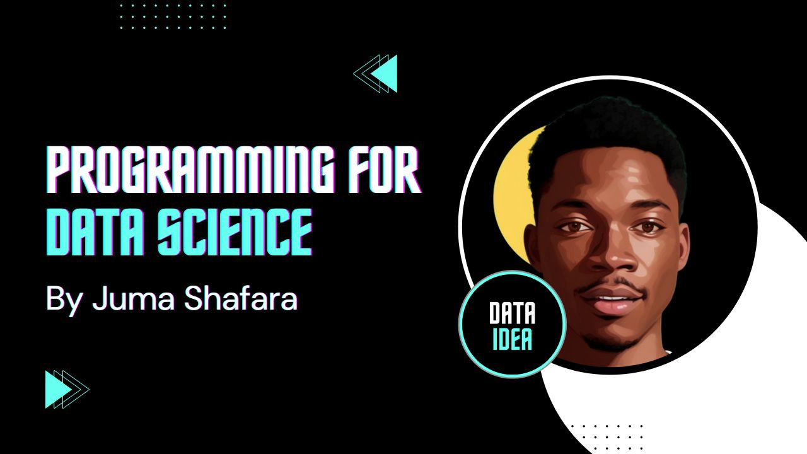
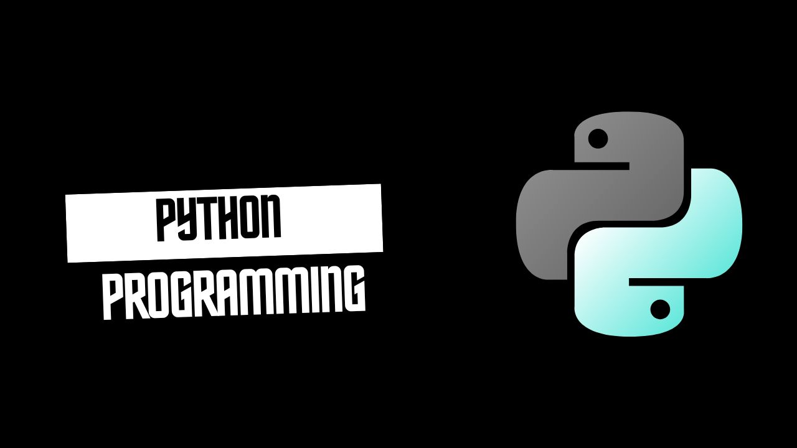
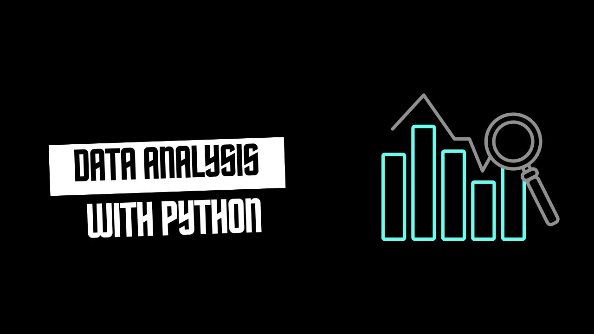
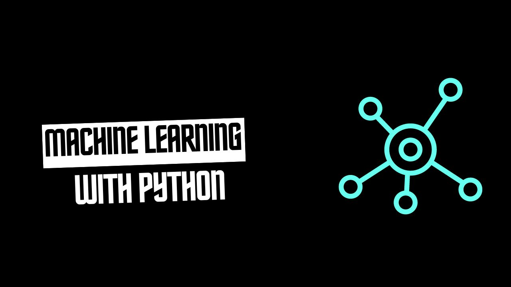
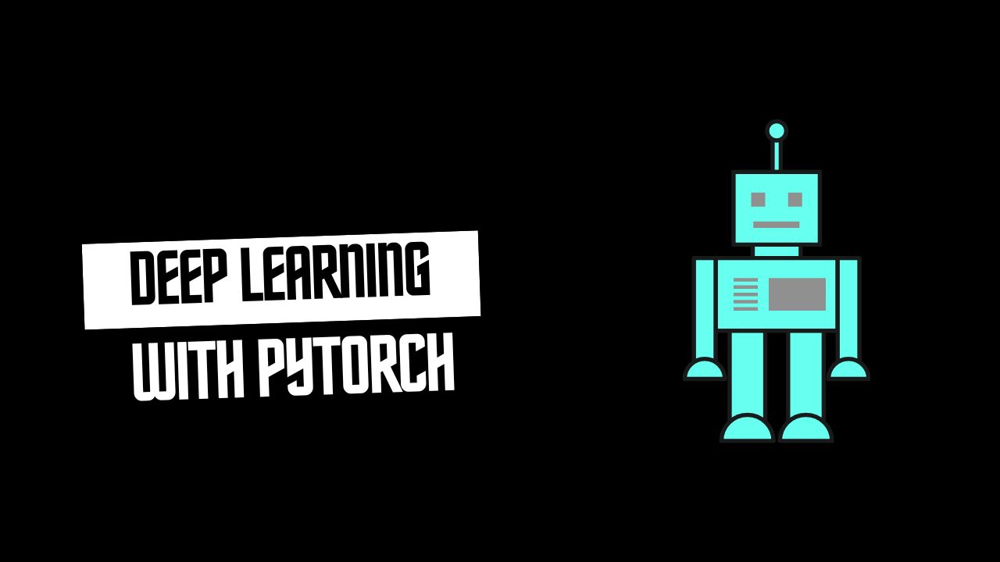

<!-- Hero Section -->

  

    

      

        # Programming for Data Science
        
        A comprehensive and dynamic course designed to equip you with the skills to thrive in today's data-driven world.
        
        [Explore Courses](#course-modules){.hero-btn .pulse}
      

      

        
      

    

  

<!-- Introduction Section -->

  ## Begin Your Data Science Journey {#about}
  
  This subject offers a structured path to mastering the tools and techniques that drive data-driven decision-making in today's industries. Whether you are a beginner looking to start your journey or an experienced professional aiming to deepen your expertise, this course has something for everyone.

<!-- Course Modules Section -->
## What You Will Learn {#course-modules .section-title .slide-up}

  <!-- Python Programming Card -->
  <a href="https://science.dataidea.org/Python/00_python_programming_outline.html" class="course-card fade-in delay-1">
    

      
    

    

      <h3 class="card-title">Python Programming</h3>
      
Start with the basics of Python, a versatile and powerful programming language. This course lays the foundation for your data science journey.

      Explore 
    

  </a>
  
  <!-- Python Data Analysis Card -->
  <a href="https://science.dataidea.org/Python-Data-Analysis/python_data_analysis_outline.html" class="course-card fade-in delay-2">
    

      
    

    

      <h3 class="card-title">Python Data Analysis</h3>
      
Explore data analysis using libraries like Pandas, NumPy, and Matplotlib. Learn to transform raw data into actionable insights.

      Explore 
    

  </a>
  
  <!-- Machine Learning Card -->
  <a href="https://science.dataidea.org/Python-Data-Analysis/Week4-ML-Intro/41_overview_of_machine_learning.html" class="course-card fade-in delay-3">
    

      
    

    

      <h3 class="card-title">Machine Learning (Python)</h3>
      
Discover the principles of machine learning and gain hands-on experience in building and optimizing models.

      Explore 
    

  </a>
  
  <!-- PyTorch Deep Learning Card -->
  <a href="https://science.dataidea.org/Pytorch-Deep-Learning/outline.html" class="course-card fade-in delay-4">
    

      
    

    

      <h3 class="card-title">PyTorch Deep Learning</h3>
      
Dive deep into neural networks and learn to build advanced models using PyTorch.

      Explore 
    

  </a>

<!-- Features Section -->

  ## Why Choose This Course?
  
  

    

      <h4 class="feature-title">
        
        Hands-On Learning
      </h4>
      
Each module is designed with practical exercises and real-world projects to ensure you can apply what you've learned.

    

    
    

      <h4 class="feature-title">
        
        Flexible Learning Path
      </h4>
      
Choose to follow the entire course or focus on specific modules that meet your individual learning goals.

    

    
    

      <h4 class="feature-title">
        
        Expert Guidance
      </h4>
      
Gain insights from industry professionals who are passionate about data science and dedicated to your success.

    

    
    

      <h4 class="feature-title">
        
        Career-Ready Skills
      </h4>
      
By the end of this course, you'll be ready to tackle data science challenges, whether you're transitioning careers or enhancing your current role.

    

  

<!-- Newsletter Section -->

  <h3>
    
    Don't Miss Any Updates!
  </h3>
  

    Before we continue, we have a humble request, to be among the first to hear about future updates of the course materials, simply enter your email below, follow us on 
    <a href="https://x.com/dataideaorg">
       (formally Twitter)
    </a>, 
    or subscribe to our 
    <a href="https://www.youtube.com/@dataidea-science">
       YouTube channel
    </a>.
  

  <iframe class="newsletter-frame" src="https://embeds.beehiiv.com/5fc7c425-9c7e-4e08-a514-ad6c22beee74?slim=true" data-test-id="beehiiv-embed" height="52" frameborder="0" scrolling="no">
  </iframe>

<!-- Author Section -->

  

    
  

  

    ## About the Author
    
    Hi, My name is Juma Shafara. I'm a Data Scientist at Raising The Village and Instructor at DATAIDEA. I have taught hundreds of people Programming, Data Analysis and Machine Learning.
    
    I enjoy developing innovative algorithms and models that can drive insights and value. I regularly share content that I find useful throughout my work/learning/teaching journey to simplify concepts in Machine Learning, Mathematics, Programming, and related topics on my website [jumashafara.dataidea.org](https://jumashafara.dataidea.org).
    
    Besides these technical aspects, I enjoy watching soccer, movies and reading mystery books.
    
    

      <a href="https://x.com/dataideaorg" class="social-link">
        
      </a>
      <a href="https://www.youtube.com/@dataidea-science" class="social-link">
        
      </a>
      <a href="mailto:dataideaorg@gmail.com" class="social-link">
        
      </a>
    

  

 